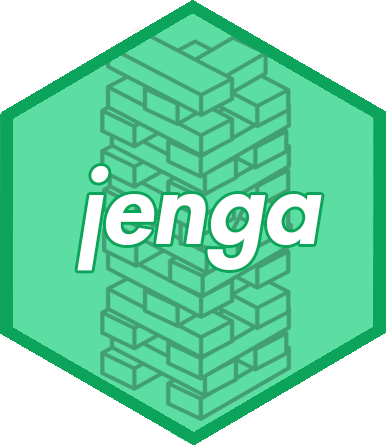

jenga 
======================================================

Save .RData files in an efficient jenga stack.

Overview
--------

**jenga** is a small, easy to use package, which allows users to create a "jenga stack" - that is, a named list to be 


Installation
--------

```r
# Install the development version from GitHub:
# install.packages("devtools")
devtools::install_github("sarahromanes/jenga")

```


Usage
-----

We can initialise a jenga stack as follows:

```r
slots    <- c("Sim 1", "Sim 2", "Sim 3")
my.jenga <- create.stack(slots)
```
We can then examine the status of our stack by calling ```status.stack```:

```r
status.stack(my.jenga)
```

Returning:

```r
All slots are empty!
```

It is easy to update a slot using jenga. Using ```update.stack```, we simultaneously update the jenga stack in the global environment, and by default, save the file to disk with the file name the name of the jenga stack. 

```r
new.data <- c(1,2,3)
update.stack(my.jenga, object = new.data, slot = "Sim 1")
```


## Authors

* **Sarah Romanes**  - [@sarah_romanes](https://twitter.com/sarah_romanes)

## License

This project is licensed under the MIT License - see the [LICENSE.md](LICENSE.md) file for details


