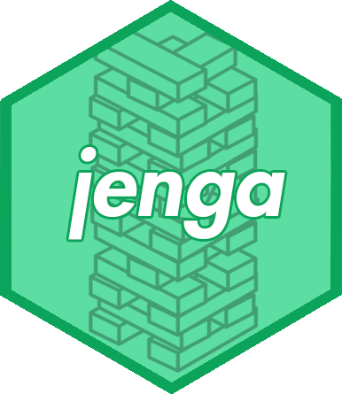

jenga 
======================================================

Save .RData files in an efficient jenga stack.

Overview
--------

**jenga** is a small, easy to use package, which allows users to create a "jenga stack" - that is, a named list which can easily updated and saved to memory! **This package is still under active development so any suggestions are welcome!** Work is being done to improve how the RData file saves/overwrites on disk, and also work is being done on the `merge_stack` functions. :construction:

Installation
--------

```r
# Install the development version from GitHub:
# install.packages("devtools")
devtools::install_github("sarahromanes/jenga")

```


Motivation
---------

I motivate its usefulness by describing a scenario which occured whilst developing simulations for my [**multiDA**]("https://github.com/sarahromanes/multiDA") paper. Quite often I run my simulations on a high performance computing system to run the algorithm seamlessly over many cores. However, any glitch in the internet connection over wifi results in my session being cancelled. As such, I had many simulation results saved to disk as soon as they had completed running:


Frustrated that I had to save many RData files, I developed *jenga* - a package that allowed me to update a single list in R, **and save the list on command to the same file name** - hence reducing the number of RData files in my directory. The concept is simple, the list is now a "jenga stack", with slots that can be updated on command. By default, every update to the stack will save the file to disk to the name of the stack. The jenga package has functionality to *create*, *update*, *merge*, *extend* and check on the *status* of such stacks.


Usage
-----

See the vignette for a detailed guide on how to use jenga! 

## Authors

* **Sarah Romanes**  - [@sarah_romanes](https://twitter.com/sarah_romanes)

## License

This project is licensed under the GPL-2 License.


